# Internal Documentation Assistant (RAG)

A domain-specific Retrieval-Augmented Generation (RAG) system for answering
questions over internal software documentation using FastAPI documents.

The system retrieves relevant Markdown documentation using semantic search
and generates grounded answers strictly from the retrieved content.
It is designed as an internal engineering tool with a strong focus on
correctness, explainability, and hallucination control.

---

## ✨ Key Features

- Semantic retrieval over Markdown documentation using FAISS
- Source attribution for every answer
- Modular ingestion, retrieval, and generation pipeline
- Fully local and reproducible (no paid APIs)

---

## 🏗️ Architecture Overview

```mermaid
flowchart TD
    A[Markdown Docs<br/>data/raw/*.md]
    B[Ingestion Pipeline<br/>• clean markdown<br/>• chunk by section]
    C[Embedding Generation<br/>SentenceTransformer<br/>intfloat/e5-base]
    D[Vector Index<br/>FAISS<br/>Cosine Similarity]
    E[Query-Time Retrieval<br/>• embed query<br/>• top-k search]
    F[Answer Generation<br/>FLAN-T5<br/>• grounded summarization<br/>• deterministic decoding<br/>• refuse if not found]
    G[Streamlit UI<br/>• answer<br/>• sources<br/>• debug context]

    A --> B
    B --> C
    C --> D
    D --> E
    E --> F
    F --> G
```



---

## 🧪 Example Queries

### Authentication

**Question**
```
Which authentication method is mentioned?
```

**Answer**
```
OAuth2 with Password (and hashing), Bearer with JWT tokens.
```

**Sources**
- authentication.md
- dependency_injection.md

---

### Presence Query

**Question**
```
Is OAuth2 mentioned in the documentation?
```

**Answer**
```
Yes. OAuth2 is mentioned and described as part of the authentication flow.
```

**Sources**
- authentication.md

---

## 🚀 How to Run

```bash
python -m venv venv
source venv/bin/activate
pip install -r requirements.txt
python -m src.build_index
streamlit run app/ui.py
```

---

## 🎯 Design Philosophy

- Retrieval first, generation second
- Prefer extraction over abstraction
- Fail explicitly instead of hallucinating
- Keep the system explainable and debuggable

---

## 📄 License

MIT
