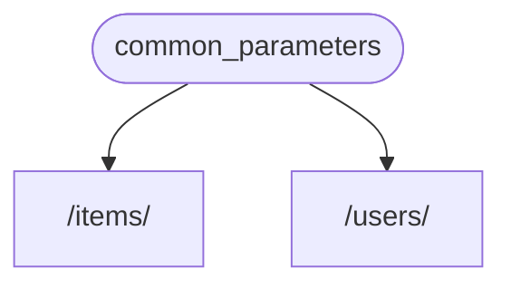
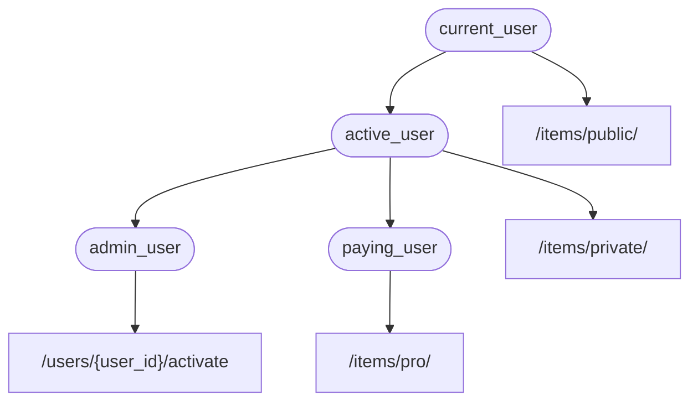

# Dependencies[¶](#dependencies "Permanent link"){.headerlink preview=""}

**FastAPI** has a very powerful but intuitive **[Dependency
Injection]{.abbr
title="also known as components, resources, providers, services, injectables"}**
system.

It is designed to be very simple to use, and to make it very easy for
any developer to integrate other components with **FastAPI**.

## What is \"Dependency Injection\"[¶](#what-is-dependency-injection "Permanent link"){.headerlink preview=""}

**\"Dependency Injection\"** means, in programming, that there is a way
for your code (in this case, your *path operation functions*) to declare
things that it requires to work and use: \"dependencies\".

And then, that system (in this case **FastAPI**) will take care of doing
whatever is needed to provide your code with those needed dependencies
(\"inject\" the dependencies).

This is very useful when you need to:

- Have shared logic (the same code logic again and again).
- Share database connections.
- Enforce security, authentication, role requirements, etc.
- And many other things\...

All these, while minimizing code repetition.

## First Steps[¶](#first-steps "Permanent link"){.headerlink preview=""}

Let\'s see a very simple example. It will be so simple that it is not
very useful, for now.

But this way we can focus on how the **Dependency Injection** system
works.

### Create a dependency, or \"dependable\"[¶](#create-a-dependency-or-dependable "Permanent link"){.headerlink preview=""}

Let\'s first focus on the dependency.

It is just a function that can take all the same parameters that a *path
operation function* can take:

::::::: {.tabbed-set .tabbed-alternate tabs="1:1"}
::: tabbed-labels
Python 3.10+
:::

::::: tabbed-content
:::: tabbed-block
::: highlight
    from typing import Annotated

    from fastapi import Depends, FastAPI

    app = FastAPI()

    async def common_parameters(q: str | None = None, skip: int = 0, limit: int = 100):
        return {"q": q, "skip": skip, "limit": limit}

    @app.get("/items/")
    async def read_items(commons: Annotated[dict, Depends(common_parameters)]):
        return commons

    @app.get("/users/")
    async def read_users(commons: Annotated[dict, Depends(common_parameters)]):
        return commons
:::
::::
:::::
:::::::

🤓 Other versions and variants

::::::::::::::: {.tabbed-set .tabbed-alternate tabs="2:4"}
::: tabbed-labels
Python 3.9+Python 3.8+Python 3.10+ - non-AnnotatedPython 3.8+ -
non-Annotated
:::

::::::::::::: tabbed-content
:::: tabbed-block
::: highlight
    from typing import Annotated, Union

    from fastapi import Depends, FastAPI

    app = FastAPI()

    async def common_parameters(
        q: Union[str, None] = None, skip: int = 0, limit: int = 100
    ):
        return {"q": q, "skip": skip, "limit": limit}

    @app.get("/items/")
    async def read_items(commons: Annotated[dict, Depends(common_parameters)]):
        return commons

    @app.get("/users/")
    async def read_users(commons: Annotated[dict, Depends(common_parameters)]):
        return commons
:::
::::

:::: tabbed-block
::: highlight
    from typing import Union

    from fastapi import Depends, FastAPI
    from typing_extensions import Annotated

    app = FastAPI()

    async def common_parameters(
        q: Union[str, None] = None, skip: int = 0, limit: int = 100
    ):
        return {"q": q, "skip": skip, "limit": limit}

    @app.get("/items/")
    async def read_items(commons: Annotated[dict, Depends(common_parameters)]):
        return commons

    @app.get("/users/")
    async def read_users(commons: Annotated[dict, Depends(common_parameters)]):
        return commons
:::
::::

::::: tabbed-block
::: {.admonition .tip}
Tip

Prefer to use the `Annotated` version if possible.
:::

::: highlight
    from fastapi import Depends, FastAPI

    app = FastAPI()

    async def common_parameters(q: str | None = None, skip: int = 0, limit: int = 100):
        return {"q": q, "skip": skip, "limit": limit}

    @app.get("/items/")
    async def read_items(commons: dict = Depends(common_parameters)):
        return commons

    @app.get("/users/")
    async def read_users(commons: dict = Depends(common_parameters)):
        return commons
:::
:::::

::::: tabbed-block
::: {.admonition .tip}
Tip

Prefer to use the `Annotated` version if possible.
:::

::: highlight
    from typing import Union

    from fastapi import Depends, FastAPI

    app = FastAPI()

    async def common_parameters(
        q: Union[str, None] = None, skip: int = 0, limit: int = 100
    ):
        return {"q": q, "skip": skip, "limit": limit}

    @app.get("/items/")
    async def read_items(commons: dict = Depends(common_parameters)):
        return commons

    @app.get("/users/")
    async def read_users(commons: dict = Depends(common_parameters)):
        return commons
:::
:::::
:::::::::::::
:::::::::::::::

That\'s it.

**2 lines**.

And it has the same shape and structure that all your *path operation
functions* have.

You can think of it as a *path operation function* without the
\"decorator\" (without the `@app.get("/some-path")`).

And it can return anything you want.

In this case, this dependency expects:

- An optional query parameter `q` that is a `str`.
- An optional query parameter `skip` that is an `int`, and by default is
  `0`.
- An optional query parameter `limit` that is an `int`, and by default
  is `100`.

And then it just returns a `dict` containing those values.

::: {.admonition .info}
Info

FastAPI added support for `Annotated` (and started recommending it) in
version 0.95.0.

If you have an older version, you would get errors when trying to use
`Annotated`.

Make sure you [Upgrade the FastAPI
version](../../deployment/versions/#upgrading-the-fastapi-versions){.internal-link
preview="" target="_blank"} to at least 0.95.1 before using `Annotated`.
:::

### Import `Depends`[¶](#import-depends "Permanent link"){.headerlink preview=""}

::::::: {.tabbed-set .tabbed-alternate tabs="3:1"}
::: tabbed-labels
Python 3.10+
:::

::::: tabbed-content
:::: tabbed-block
::: highlight
    from typing import Annotated

    from fastapi import Depends, FastAPI

    app = FastAPI()

    async def common_parameters(q: str | None = None, skip: int = 0, limit: int = 100):
        return {"q": q, "skip": skip, "limit": limit}

    @app.get("/items/")
    async def read_items(commons: Annotated[dict, Depends(common_parameters)]):
        return commons

    @app.get("/users/")
    async def read_users(commons: Annotated[dict, Depends(common_parameters)]):
        return commons
:::
::::
:::::
:::::::

🤓 Other versions and variants

::::::::::::::: {.tabbed-set .tabbed-alternate tabs="4:4"}
::: tabbed-labels
Python 3.9+Python 3.8+Python 3.10+ - non-AnnotatedPython 3.8+ -
non-Annotated
:::

::::::::::::: tabbed-content
:::: tabbed-block
::: highlight
    from typing import Annotated, Union

    from fastapi import Depends, FastAPI

    app = FastAPI()

    async def common_parameters(
        q: Union[str, None] = None, skip: int = 0, limit: int = 100
    ):
        return {"q": q, "skip": skip, "limit": limit}

    @app.get("/items/")
    async def read_items(commons: Annotated[dict, Depends(common_parameters)]):
        return commons

    @app.get("/users/")
    async def read_users(commons: Annotated[dict, Depends(common_parameters)]):
        return commons
:::
::::

:::: tabbed-block
::: highlight
    from typing import Union

    from fastapi import Depends, FastAPI
    from typing_extensions import Annotated

    app = FastAPI()

    async def common_parameters(
        q: Union[str, None] = None, skip: int = 0, limit: int = 100
    ):
        return {"q": q, "skip": skip, "limit": limit}

    @app.get("/items/")
    async def read_items(commons: Annotated[dict, Depends(common_parameters)]):
        return commons

    @app.get("/users/")
    async def read_users(commons: Annotated[dict, Depends(common_parameters)]):
        return commons
:::
::::

::::: tabbed-block
::: {.admonition .tip}
Tip

Prefer to use the `Annotated` version if possible.
:::

::: highlight
    from fastapi import Depends, FastAPI

    app = FastAPI()

    async def common_parameters(q: str | None = None, skip: int = 0, limit: int = 100):
        return {"q": q, "skip": skip, "limit": limit}

    @app.get("/items/")
    async def read_items(commons: dict = Depends(common_parameters)):
        return commons

    @app.get("/users/")
    async def read_users(commons: dict = Depends(common_parameters)):
        return commons
:::
:::::

::::: tabbed-block
::: {.admonition .tip}
Tip

Prefer to use the `Annotated` version if possible.
:::

::: highlight
    from typing import Union

    from fastapi import Depends, FastAPI

    app = FastAPI()

    async def common_parameters(
        q: Union[str, None] = None, skip: int = 0, limit: int = 100
    ):
        return {"q": q, "skip": skip, "limit": limit}

    @app.get("/items/")
    async def read_items(commons: dict = Depends(common_parameters)):
        return commons

    @app.get("/users/")
    async def read_users(commons: dict = Depends(common_parameters)):
        return commons
:::
:::::
:::::::::::::
:::::::::::::::

### Declare the dependency, in the \"dependant\"[¶](#declare-the-dependency-in-the-dependant "Permanent link"){.headerlink preview=""}

The same way you use `Body`, `Query`, etc. with your *path operation
function* parameters, use `Depends` with a new parameter:

::::::: {.tabbed-set .tabbed-alternate tabs="5:1"}
::: tabbed-labels
Python 3.10+
:::

::::: tabbed-content
:::: tabbed-block
::: highlight
    from typing import Annotated

    from fastapi import Depends, FastAPI

    app = FastAPI()

    async def common_parameters(q: str | None = None, skip: int = 0, limit: int = 100):
        return {"q": q, "skip": skip, "limit": limit}

    @app.get("/items/")
    async def read_items(commons: Annotated[dict, Depends(common_parameters)]):
        return commons

    @app.get("/users/")
    async def read_users(commons: Annotated[dict, Depends(common_parameters)]):
        return commons
:::
::::
:::::
:::::::

🤓 Other versions and variants

::::::::::::::: {.tabbed-set .tabbed-alternate tabs="6:4"}
::: tabbed-labels
Python 3.9+Python 3.8+Python 3.10+ - non-AnnotatedPython 3.8+ -
non-Annotated
:::

::::::::::::: tabbed-content
:::: tabbed-block
::: highlight
    from typing import Annotated, Union

    from fastapi import Depends, FastAPI

    app = FastAPI()

    async def common_parameters(
        q: Union[str, None] = None, skip: int = 0, limit: int = 100
    ):
        return {"q": q, "skip": skip, "limit": limit}

    @app.get("/items/")
    async def read_items(commons: Annotated[dict, Depends(common_parameters)]):
        return commons

    @app.get("/users/")
    async def read_users(commons: Annotated[dict, Depends(common_parameters)]):
        return commons
:::
::::

:::: tabbed-block
::: highlight
    from typing import Union

    from fastapi import Depends, FastAPI
    from typing_extensions import Annotated

    app = FastAPI()

    async def common_parameters(
        q: Union[str, None] = None, skip: int = 0, limit: int = 100
    ):
        return {"q": q, "skip": skip, "limit": limit}

    @app.get("/items/")
    async def read_items(commons: Annotated[dict, Depends(common_parameters)]):
        return commons

    @app.get("/users/")
    async def read_users(commons: Annotated[dict, Depends(common_parameters)]):
        return commons
:::
::::

::::: tabbed-block
::: {.admonition .tip}
Tip

Prefer to use the `Annotated` version if possible.
:::

::: highlight
    from fastapi import Depends, FastAPI

    app = FastAPI()

    async def common_parameters(q: str | None = None, skip: int = 0, limit: int = 100):
        return {"q": q, "skip": skip, "limit": limit}

    @app.get("/items/")
    async def read_items(commons: dict = Depends(common_parameters)):
        return commons

    @app.get("/users/")
    async def read_users(commons: dict = Depends(common_parameters)):
        return commons
:::
:::::

::::: tabbed-block
::: {.admonition .tip}
Tip

Prefer to use the `Annotated` version if possible.
:::

::: highlight
    from typing import Union

    from fastapi import Depends, FastAPI

    app = FastAPI()

    async def common_parameters(
        q: Union[str, None] = None, skip: int = 0, limit: int = 100
    ):
        return {"q": q, "skip": skip, "limit": limit}

    @app.get("/items/")
    async def read_items(commons: dict = Depends(common_parameters)):
        return commons

    @app.get("/users/")
    async def read_users(commons: dict = Depends(common_parameters)):
        return commons
:::
:::::
:::::::::::::
:::::::::::::::

Although you use `Depends` in the parameters of your function the same
way you use `Body`, `Query`, etc, `Depends` works a bit differently.

You only give `Depends` a single parameter.

This parameter must be something like a function.

You **don\'t call it** directly (don\'t add the parenthesis at the end),
you just pass it as a parameter to `Depends()`.

And that function takes parameters in the same way that *path operation
functions* do.

::: {.admonition .tip}
Tip

You\'ll see what other \"things\", apart from functions, can be used as
dependencies in the next chapter.
:::

Whenever a new request arrives, **FastAPI** will take care of:

- Calling your dependency (\"dependable\") function with the correct
  parameters.
- Get the result from your function.
- Assign that result to the parameter in your *path operation function*.

This way you write shared code once and **FastAPI** takes care of
calling it for your *path operations*.

::: {.admonition .check}
Check

Notice that you don\'t have to create a special class and pass it
somewhere to **FastAPI** to \"register\" it or anything similar.

You just pass it to `Depends` and **FastAPI** knows how to do the rest.
:::

## Share `Annotated` dependencies[¶](#share-annotated-dependencies "Permanent link"){.headerlink preview=""}

In the examples above, you see that there\'s a tiny bit of **code
duplication**.

When you need to use the `common_parameters()` dependency, you have to
write the whole parameter with the type annotation and `Depends()`:

::: highlight
    commons: Annotated[dict, Depends(common_parameters)]
:::

But because we are using `Annotated`, we can store that `Annotated`
value in a variable and use it in multiple places:

::::::: {.tabbed-set .tabbed-alternate tabs="7:1"}
::: tabbed-labels
Python 3.10+
:::

::::: tabbed-content
:::: tabbed-block
::: highlight
    from typing import Annotated

    from fastapi import Depends, FastAPI

    app = FastAPI()

    async def common_parameters(q: str | None = None, skip: int = 0, limit: int = 100):
        return {"q": q, "skip": skip, "limit": limit}

    CommonsDep = Annotated[dict, Depends(common_parameters)]

    @app.get("/items/")
    async def read_items(commons: CommonsDep):
        return commons

    @app.get("/users/")
    async def read_users(commons: CommonsDep):
        return commons
:::
::::
:::::
:::::::

🤓 Other versions and variants

::::::::: {.tabbed-set .tabbed-alternate tabs="8:2"}
::: tabbed-labels
Python 3.9+Python 3.8+
:::

::::::: tabbed-content
:::: tabbed-block
::: highlight
    from typing import Annotated, Union

    from fastapi import Depends, FastAPI

    app = FastAPI()

    async def common_parameters(
        q: Union[str, None] = None, skip: int = 0, limit: int = 100
    ):
        return {"q": q, "skip": skip, "limit": limit}

    CommonsDep = Annotated[dict, Depends(common_parameters)]

    @app.get("/items/")
    async def read_items(commons: CommonsDep):
        return commons

    @app.get("/users/")
    async def read_users(commons: CommonsDep):
        return commons
:::
::::

:::: tabbed-block
::: highlight
    from typing import Union

    from fastapi import Depends, FastAPI
    from typing_extensions import Annotated

    app = FastAPI()

    async def common_parameters(
        q: Union[str, None] = None, skip: int = 0, limit: int = 100
    ):
        return {"q": q, "skip": skip, "limit": limit}

    CommonsDep = Annotated[dict, Depends(common_parameters)]

    @app.get("/items/")
    async def read_items(commons: CommonsDep):
        return commons

    @app.get("/users/")
    async def read_users(commons: CommonsDep):
        return commons
:::
::::
:::::::
:::::::::

::: {.admonition .tip}
Tip

This is just standard Python, it\'s called a \"type alias\", it\'s
actually not specific to **FastAPI**.

But because **FastAPI** is based on the Python standards, including
`Annotated`, you can use this trick in your code. 😎
:::

The dependencies will keep working as expected, and the **best part** is
that the **type information will be preserved**, which means that your
editor will be able to keep providing you with **autocompletion**,
**inline errors**, etc. The same for other tools like `mypy`.

This will be especially useful when you use it in a **large code base**
where you use **the same dependencies** over and over again in **many
*path operations***.

## To `async` or not to `async`[¶](#to-async-or-not-to-async "Permanent link"){.headerlink preview=""}

As dependencies will also be called by **FastAPI** (the same as your
*path operation functions*), the same rules apply while defining your
functions.

You can use `async def` or normal `def`.

And you can declare dependencies with `async def` inside of normal `def`
*path operation functions*, or `def` dependencies inside of `async def`
*path operation functions*, etc.

It doesn\'t matter. **FastAPI** will know what to do.

::: {.admonition .note}
Note

If you don\'t know, check the [Async: *\"In a
hurry?\"*](../../async/#in-a-hurry){.internal-link preview=""
target="_blank"} section about `async` and `await` in the docs.
:::

## Integrated with OpenAPI[¶](#integrated-with-openapi "Permanent link"){.headerlink preview=""}

All the request declarations, validations and requirements of your
dependencies (and sub-dependencies) will be integrated in the same
OpenAPI schema.

So, the interactive docs will have all the information from these
dependencies too:

## Simple usage[¶](#simple-usage "Permanent link"){.headerlink preview=""}

If you look at it, *path operation functions* are declared to be used
whenever a *path* and *operation* matches, and then **FastAPI** takes
care of calling the function with the correct parameters, extracting the
data from the request.

Actually, all (or most) of the web frameworks work in this same way.

You never call those functions directly. They are called by your
framework (in this case, **FastAPI**).

With the Dependency Injection system, you can also tell **FastAPI** that
your *path operation function* also \"depends\" on something else that
should be executed before your *path operation function*, and
**FastAPI** will take care of executing it and \"injecting\" the
results.

Other common terms for this same idea of \"dependency injection\" are:

- resources
- providers
- services
- injectables
- components

## **FastAPI** plug-ins[¶](#fastapi-plug-ins "Permanent link"){.headerlink preview=""}

Integrations and \"plug-ins\" can be built using the **Dependency
Injection** system. But in fact, there is actually **no need to create
\"plug-ins\"**, as by using dependencies it\'s possible to declare an
infinite number of integrations and interactions that become available
to your *path operation functions*.

And dependencies can be created in a very simple and intuitive way that
allows you to just import the Python packages you need, and integrate
them with your API functions in a couple of lines of code, *literally*.

You will see examples of this in the next chapters, about relational and
NoSQL databases, security, etc.

## **FastAPI** compatibility[¶](#fastapi-compatibility "Permanent link"){.headerlink preview=""}

The simplicity of the dependency injection system makes **FastAPI**
compatible with:

- all the relational databases
- NoSQL databases
- external packages
- external APIs
- authentication and authorization systems
- API usage monitoring systems
- response data injection systems
- etc.

## Simple and Powerful[¶](#simple-and-powerful "Permanent link"){.headerlink preview=""}

Although the hierarchical dependency injection system is very simple to
define and use, it\'s still very powerful.

You can define dependencies that in turn can define dependencies
themselves.

In the end, a hierarchical tree of dependencies is built, and the
**Dependency Injection** system takes care of solving all these
dependencies for you (and their sub-dependencies) and providing
(injecting) the results at each step.

For example, let\'s say you have 4 API endpoints (*path operations*):

- `/items/public/`
- `/items/private/`
- `/users/{user_id}/activate`
- `/items/pro/`

then you could add different permission requirements for each of them
just with dependencies and sub-dependencies:

## Integrated with **OpenAPI**[¶](#integrated-with-openapi_1 "Permanent link"){.headerlink preview=""} {#integrated-with-openapi_1}

All these dependencies, while declaring their requirements, also add
parameters, validations, etc. to your *path operations*.

**FastAPI** will take care of adding it all to the OpenAPI schema, so
that it is shown in the interactive documentation systems.
:::::::::::::::::::::::::::::::::::::::::::::::::::::::::::::::::::::::::::
:::::::::::::::::::::::::::::::::::::::::::::::::::::::::::::::::::::::::::::::::::::::::::::::::

Back to top
::::::::::::::::::::::::::::::::::::::::::::::::::::::::::::::::::::::::::::::::::::::::::::::::::
